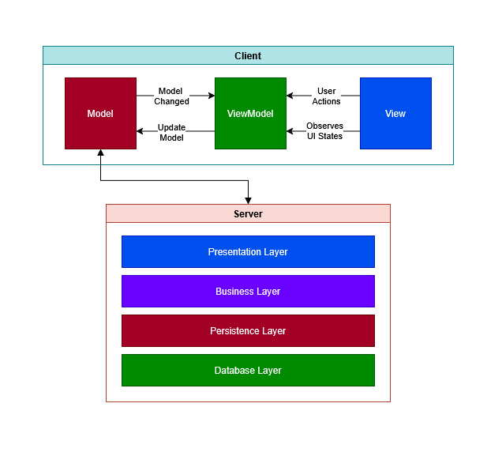

# Documentação da Arquitetura de Software

## 1. Arquitetura de Software Escolhida 

**Qual arquitetura de software foi escolhida para o projeto?**  

> *(Ex: MVC, Cliente-Servidor, Microsserviços, Monolítica, Event-Driven, etc.)*

O sistema será desenvolvido seguindo uma arquitetura cliente-servidor modular, dividida em Front-end e Back-end seguindo arquiteturas MVVM e Arquitetura em Camadas, respectivamente.

**Justifique a escolha dessa arquitetura em relação ao tipo de sistema proposto:**  
> Explique por que essa arquitetura é adequada para o problema que o sistema pretende resolver.  
> Considere aspectos como escalabilidade, complexidade do sistema, comunicação entre partes, etc.

O Pilot será um aplicativo mobile, com expectativo de receber uma versão web. Portanto, separar os módulos entre cliente(Front-end) e servidor(Back-end) é o ideal, onde os clientes mobile e web consultariam o mesmo servidor, isso proporciona uma alta escalabilidade e flexibilidade para o projeto. Além disso, sua fácil implementação e o fato de que os dados e lógica estão centralizados aumenta a manutenibilidade, o que combina com o tamanho reduzido da equipe envolvida no projeto.

## 2. Diagrama da Arquitetura

O sistema á basedo na arquitetura de rede Cliente-Servidor onde o cliente (_Client_), que é o front-end do sistema, solicita serviços ao servidor e o servidor (_Server_), back-end do sistema, é responsável por receber, tratar e retornar alguma uma resposta para a solicitação feita. A comunicação entre esses dois módulos se dá por meio do protocolo HTTP.

O cliente, também chamado de front-end, segue a **arquitetura MVVM**. Essa arquitetura é dividida em três módulos principais: o _Model_, _ViewModel_ e o _View_. O _Model_ é representa os dados e a lógica de negócio do aplicativo, ele oferece métodos para acessar e manipular os dados, portanto, ele se comunica com o servidor e com o módulo _ViewModel_. Este, por sua vez, trabalha como um intermediário entre o _Model_ e o _View_, transformando os dados do _Model_ em formato adequado para o View e atualizando o _Model_ de acordo com os eventos realizados pelo usuário. Por último, o _View_ é a UI com a qual o usuário interage e deve conter a menor quantidade de lógica de negócio possível.

O servidor, também chamado de back-end, segue a **arquitetura em Camadas**, onde cada camada tem uma responsabilidade bem definida e só se comunica com as camadas adjacentes à ela. Essa arquitetura em específico usa 4 camadas: _presentation layer, business Layer, persistence layer_ e a _database layer_. A _presentation layer_ é responsável por conter a lógica de comunicação com o mundo exterior à aplicação, nesse caso, seriam os clientes do nosso servidor. A _Business layer_ tem o objetivo de executar operações e fluxos de negócios relacionados à requisição específica. _A persistence layer_ persiste ou recupera informações da base de dados usada no servidor e a _database layer_ é exatamente o banco de dados que vai salvar os dados recebidos e ser consultado sobre eles.

## 3. Escolhas Tecnológicas 

- Linguagem de programação:
    - Java
    - Dart
- Frameworks e bibliotecas:
    - Sprintboot
    - Flutter
- Banco de dados:
    - PostgreSQL
    - JPA/Hibernate
- Outras ferramentas (ex: autenticação, testes, versionamento):
    - GitHub/Git
    - RabbitMQ
    - Redis
    - JWT
    - AWS

**Justifique suas escolhas em relação aos requisitos do sistema:**  
> Explique como essas tecnologias ajudam a atender os requisitos funcionais e não funcionais.  
> Comente sobre facilidade de uso, suporte da comunidade, integração com outras ferramentas, etc.

As linguagens de programação e frameworks foram escolhidas por causa da familiaridade da equipe com elas, por causa da simplicidade de uso e comunidade muito ativa. O Flutter já disponibiliza várias ferramentas pré-prontas para a criação de aplicativos mobile, além de possuir o Dio para requisições HTTP. Já o Springboot possui uma vasta gama de ferramentas para a criação de servidores web, realização de testes unitários com JUnit, segurança e autenticação com Spring Security e JWT e suporte à outras ferramentas que serão usadas, como é o caso do Redis e do RabbitMQ.

O RabbitMQ e o Redis vão ajudar a tornar a aplicação mais rápida e flúida para o usuário. O RabbitMQ ajuda controlando uma grande quantidade de eventos que for acontecer no aplicativo e processando mensagens no back-ground e o Redis permite armazenar eventos realizados com frequência em cache, o que deixa a solicitação desses eventos mais rápida.

O Git, Github ajudam o desenvolvimento através do versionamento de código e CI/CD com o GitHub Actions o qual automatiza o build, teste e deploy da aplicação.

Para finalizar, o PosgreSQL foi escolhido como banco de dados devido a sua natureza relacional (permite associar usuários, perfis, publicaçoes, etc), popularidade, segurança e familiaridade da equipe de desenvolvimento com ele. O JPA/Hibernate ajuda a manipular o banco de dados através das próprias entidades do back-end e seus repositoryes, promovendo uma maior agilidade nesse processo.